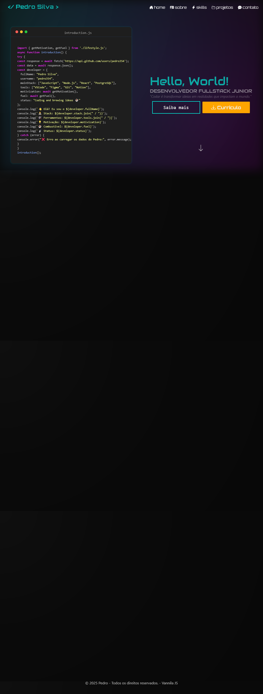

# 💻 Pedro Silva - Portfólio Fullstack

  

Bem-vindo(a) ao meu portfólio pessoal! Aqui compartilho um pouco sobre quem sou, minhas habilidades e projetos que venho desenvolvendo como **Desenvolvedor Fullstack**.

---

## 🚀 Tecnologias utilizadas

### Front-end
- HTML5
- CSS3
- JavaScript
- React.js
- Next.js
- Tailwind CSS

### Back-end
- Node.js
- Express.js
- PostgreSQL
- (Aprendendo) Python, MongoDB

### Ferramentas e Metodologias
- Git & GitHub
- Figma
- Notion
- Metodologias Ágeis (Scrum)

---

## 🌟 Funcionalidades

✅ Animações suaves com **AOS.js**  
✅ Efeito de terminal simulando código JS  
✅ Design responsivo e intuitivo  
✅ Barra de skills com preenchimento animado  
✅ Cards de projetos no estilo "terminal hacker" 😎

---

# 🎯 Objetivo

 Este portfólio tem como objetivo apresentar minhas habilidades e projetos, além de servir como um laboratório para testar novas tecnologias e aprimorar meu front-end e back-end.
# 📫 Contato

# Entre em contato comigo por aqui:

    LinkedIn: Pedro Silva

    GitHub: @pedro354

## Ver Portifólio em ação:

Ver Portifolio https://portifolio-pedrojs.vercel.app/

## 📸 Preview

# 
